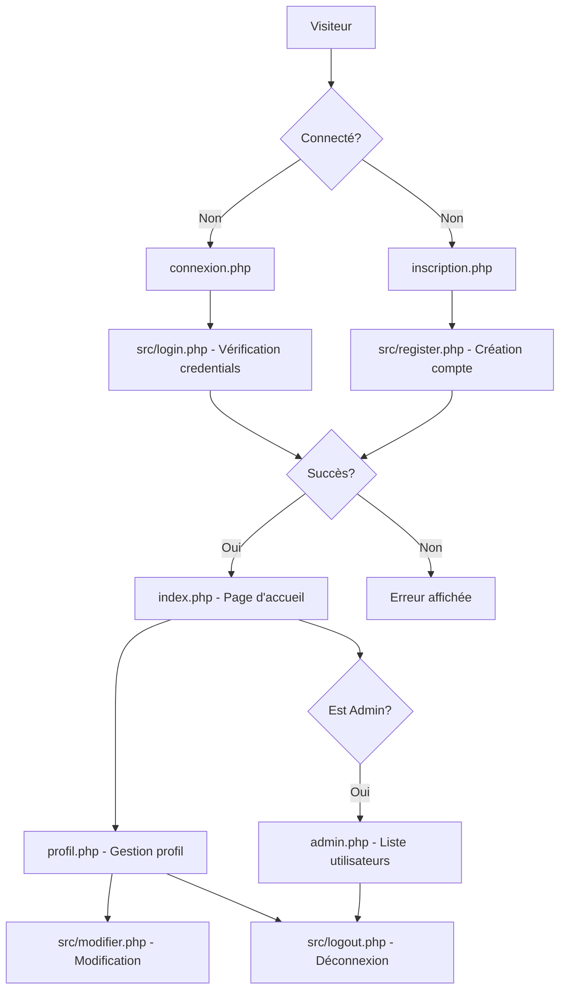

# AZIM404

## Description

AZIM404 est une application web développée en PHP qui permet la gestion d'utilisateurs avec un système d'authentification et de profils.

## Architecture du Projet

### Structure des Fichiers

```
module-connexion/
├── 📄 index.php              # Page d'accueil
├── 📄 connexion.php          # Page de connexion
├── 📄 inscription.php        # Page d'inscription
├── 📄 profil.php            # Page de profil utilisateur
├── 📄 admin.php             # Interface d'administration
├── 📄 header.php            # En-tête commun
├── 📄 footer.php            # Pied de page commun
├── 📄 moduleconnexion.sql   # Script de base de données
├── 📂 src/
│   ├── 📄 db.php           # Configuration de base de données
│   ├── 📄 login.php        # Gestion de la connexion
│   ├── 📄 logout.php       # Gestion de la déconnexion
│   ├── 📄 register.php     # Gestion de l'inscription
│   ├── 📄 modifier.php     # Modification de profil
│   └── 📄 verification.php # Vérification des sessions et permissions
└── 📂 asset/
    ├── 📂 css/
    │   └── 📄 output.css   # Styles compilés (Tailwind CSS)
    └── 📂 images/          # Images et médias
        ├── 📄 Azim404.ico
        ├── 📄 background.jpg
        ├── 📄 github.png
        └── 📄 malaisie.png
```

### Architecture Fonctionnelle

#### 1. **Couche de Présentation (Frontend)**

- **Pages principales** : `index.php`, `connexion.php`, `inscription.php`, `profil.php`, `admin.php`
- **Composants partagés** : `header.php`, `footer.php`
- **Styles** : Utilise Tailwind CSS (`output.css`) avec Flowbite pour les composants
- **Assets statiques** : Images et icônes dans le dossier `asset/`

#### 2. **Couche Logique Métier (Backend)**

- **Authentification** : 
  - `src/login.php` : Gestion des connexions
  - `src/logout.php` : Gestion des déconnexions
  - `src/register.php` : Gestion des inscriptions
  - `src/verification.php` : Vérification des sessions et permissions (admin/utilisateur)
- **Gestion des utilisateurs** : 
  - `src/modifier.php` : Modification des profils utilisateurs
- **Base de données** : Configuration et connexion via `src/db.php`

#### 3. **Couche de Données**

- **Base de données** : Scripts SQL dans `moduleconnexion.sql`
- **Configuration** : Paramètres de connexion centralisés

### Flux d'Authentification



## Prérequis

- **Serveur Web** : Apache ou Nginx
- **PHP** : Version 7.4 ou supérieure
- **MySQL** : Version 5.7 ou supérieure
- **Extensions PHP requises** :
  - PDO
  - PDO_MySQL
  - Session

## Installation

1. **Cloner le projet**

```bash
git clone https://github.com/Sofiane224434/module-connexion.git
cd module-connexion
```

2. **Configuration de la base de données**

```bash
# Se connecter à MySQL
mysql -u root -p

# Créer la base de données et importer le schéma
source moduleconnexion.sql

# Ou en une seule commande
mysql -u root -p < moduleconnexion.sql
```

3. **Configuration PHP**

- Ouvrir le fichier `src/db.php`
- Modifier les paramètres de connexion à la base de données :

```php
$pdo = new PDO("mysql:host=localhost;dbname=moduleconnexion", "root", "");
```

Remplacer `"root"` et `""` par vos identifiants MySQL si nécessaire.

4. **Démarrer le serveur**

```bash
# Option 1 : Serveur PHP intégré (développement)
php -S localhost:8000

# Option 2 : Configurer Apache/Nginx pour pointer vers le répertoire du projet
```

5. **Accéder à l'application**

Ouvrir un navigateur et accéder à :
- Serveur PHP : `http://localhost:8000`
- Apache/Nginx : `http://localhost` (selon votre configuration)

## Technologies Utilisées

- **Backend** : PHP (avec PDO pour la base de données)
- **Frontend** : 
  - HTML5
  - CSS3 avec Tailwind CSS
  - JavaScript
  - Flowbite (composants UI)
- **Base de données** : MySQL
- **Gestion des sessions** : PHP Sessions natives

## Fonctionnalités

- ✅ Système d'authentification complet (connexion/inscription)
- ✅ Gestion des profils utilisateurs avec modification
- ✅ Interface d'administration pour visualiser tous les utilisateurs
- ✅ Système de permissions (utilisateur standard / administrateur)
- ✅ Gestion des sessions sécurisée
- ✅ Design responsive avec Tailwind CSS et Flowbite
- ✅ Architecture modulaire et maintenable
- ✅ Validation des formulaires
- ✅ Messages d'erreur informatifs

## Structure de la Base de Données

### Table `utilisateurs`

| Colonne    | Type         | Description                    | Contraintes           |
|------------|--------------|--------------------------------|-----------------------|
| id         | INT          | Identifiant unique             | PRIMARY KEY, AUTO_INCREMENT |
| email      | VARCHAR(255) | Adresse email                  | UNIQUE, NOT NULL      |
| username   | VARCHAR(255) | Nom d'utilisateur              | UNIQUE, NOT NULL      |
| nom        | VARCHAR(255) | Nom de famille                 |                       |
| prenom     | VARCHAR(255) | Prénom                         |                       |
| password   | VARCHAR(255) | Mot de passe                   |                       |

**Note** : Un compte administrateur par défaut est créé lors de l'installation :
- Email : `admin`
- Username : `admin`
- Mot de passe : `admin` (⚠️ À changer immédiatement en production !)

## Utilisation

### Pour les visiteurs

1. **Inscription** : Accédez à `inscription.php` pour créer un nouveau compte
   - Renseignez : email, username, nom, prénom et mot de passe
   - Le système vérifie l'unicité de l'email et du username

2. **Connexion** : Accédez à `connexion.php` pour vous connecter
   - Utilisez votre email et mot de passe

### Pour les utilisateurs connectés

3. **Page d'accueil** : `index.php` affiche vos projets et informations
   - Navigation personnalisée selon vos droits

4. **Profil** : Gérez votre profil dans `profil.php`
   - Visualisez vos informations
   - Modifiez vos données personnelles

### Pour les administrateurs

5. **Administration** : Accédez à `admin.php` pour gérer les utilisateurs
   - Visualisez la liste complète des utilisateurs
   - Consultez les informations de chaque compte

6. **Déconnexion** : Cliquez sur le bouton de déconnexion (X) dans l'en-tête

## Sécurité

⚠️ **Important** : Cette application est conçue à des fins éducatives. Pour un usage en production, il est recommandé de :

- ✅ Utiliser `password_hash()` et `password_verify()` pour les mots de passe
- ✅ Implémenter la protection CSRF
- ✅ Valider et assainir toutes les entrées utilisateur
- ✅ Utiliser des requêtes préparées (déjà implémenté avec PDO)
- ✅ Configurer HTTPS
- ✅ Définir des politiques de mots de passe robustes
- ✅ Changer le mot de passe admin par défaut
- ✅ Limiter les tentatives de connexion
- ✅ Implémenter des logs de sécurité

## Contribution

Les contributions sont les bienvenues ! Pour contribuer :

1. Forkez le projet
2. Créez une branche feature (`git checkout -b feature/nouvelle-fonctionnalite`)
3. Commitez vos changements (`git commit -m 'Ajout nouvelle fonctionnalité'`)
4. Pushez vers la branche (`git push origin feature/nouvelle-fonctionnalite`)
5. Ouvrez une Pull Request

## Auteur

**Sofiane Kherarfa**
- GitHub: [@Sofiane224434](https://github.com/Sofiane224434)
- Site web: [sofiane-kherarfa.students-laplateforme.io](https://sofiane-kherarfa.students-laplateforme.io)

## Licence

Ce projet est développé à des fins éducatives dans le cadre d'un apprentissage du développement web.

## Captures d'écran

### Page d'accueil


### Fonctionnalités principales
- Système d'authentification intuitif
- Interface responsive
- Panel d'administration
- Gestion de profil utilisateur
