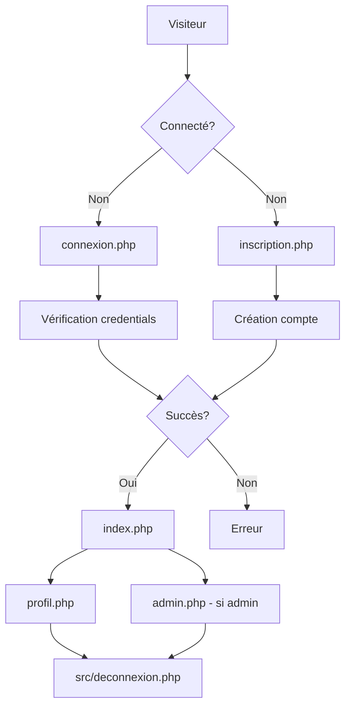

# AZIM404

## Description

AZIM404 est une application web développée en PHP qui permet la gestion d'utilisateurs avec un système d'authentification et de profils.

## Architecture du Projet

### Structure des Fichiers

```
Azim404/
├── 📄 index.php              # Page d'accueil
├── 📄 connexion.php          # Page de connexion
├── 📄 inscription.php        # Page d'inscription
├── 📄 profil.php            # Page de profil utilisateur
├── 📄 admin.php             # Interface d'administration
├── 📄 header.php            # En-tête commun
├── 📄 footer.php            # Pied de page commun
├── 📄 package.json          # Configuration Node.js/npm
├── 📄 moduleconnexion.sql   # Script de base de données
├── 📂 src/
│   ├── 📄 db.php           # Configuration de base de données
│   └── 📄 deconnexion.php  # Gestion de la déconnexion
└── 📂 assets/
    ├── 📂 css/
    │   ├── 📄 input.css    # Styles source (Tailwind CSS)
    │   └── 📄 output.css   # Styles compilés
    ├── 📂 icons/           # Icônes du site
    └── 📂 images/          # Images et médias
```

### Architecture Fonctionnelle

#### 1. **Couche de Présentation (Frontend)**

- **Pages principales** : `index.php`, `connexion.php`, `inscription.php`, `profil.php`, `admin.php`
- **Composants partagés** : `header.php`, `footer.php`
- **Styles** : Utilise Tailwind CSS (`input.css` → `output.css`)
- **Assets statiques** : Images et icônes dans le dossier `assets/`

#### 2. **Couche Logique Métier (Backend)**

- **Authentification** : Gestion des connexions/déconnexions
- **Gestion des utilisateurs** : Inscription, profils, administration
- **Base de données** : Configuration et connexion via `src/db.php`

#### 3. **Couche de Données**

- **Base de données** : Scripts SQL dans `moduleconnexion.sql`
- **Configuration** : Paramètres de connexion centralisés

### Flux d'Authentification



## Installation

1. **Cloner le projet**

```bash
git clone <repository-url>
cd Azim404
```

2. **Configuration de la base de données**

```bash
# Importer le schéma de base de données
mysql -u username -p database_name < moduleconnexion.sql
```

3. **Configuration PHP**

- Modifier `src/db.php` avec vos paramètres de base de données
- S'assurer que le serveur web pointe vers le répertoire racine

4. **Compilation des styles (optionnel)**

```bash
npm install
npm run build
```

## Technologies Utilisées

- **Backend** : PHP
- **Frontend** : HTML, CSS (Tailwind CSS), JavaScript
- **Base de données** : MySQL
- **Outils de build** : Node.js, npm

## Fonctionnalités

- ✅ Système d'authentification (connexion/inscription)
- ✅ Gestion des profils utilisateurs
- ✅ Interface d'administration
- ✅ Design responsive avec Tailwind CSS
- ✅ Architecture modulaire et maintenable

## Utilisation

1. Accédez à `index.php` pour la page d'accueil
2. Créez un compte via `inscription.php`
3. Connectez-vous via `connexion.php`
4. Gérez votre profil dans `profil.php`
5. Accès administrateur via `admin.php` (selon les droits)

## Contribution

1. Fork le projet
2. Créer une branche feature (`git checkout -b feature/nouvelle-fonctionnalite`)
3. Commit les changements (`git commit -m 'Ajout nouvelle fonctionnalité'`)
4. Push vers la branche (`git push origin feature/nouvelle-fonctionnalite`)
5. Ouvrir une Pull Request
